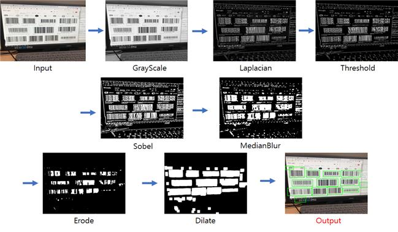
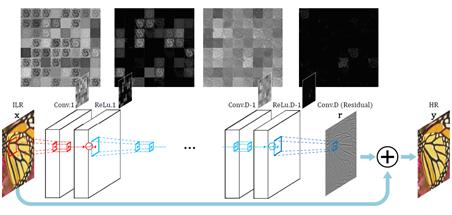
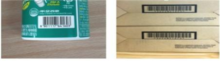
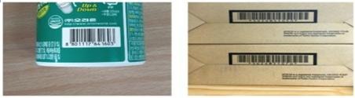

# Barcode Detection with Computer vision  + Multiple Recognition using Zbar

바코드의 특성을 활용하여 영상처리 및 OpenCV를 바탕으로 카메라로 통해 들어오는 영상에서의 바코드 영역들을  탐지한다. 또한, 오픈라이브러리인 Zbar를 사용하여 탐지된 바코드 영역들을 다중으로 인식한다.

## Demo

## Barcode Detection Algorithm

바코드를 디텍션 하기위해 아래 이미지와 같은 영상처리기법들을 사용하였다.

## Barcode Enhancement

딥러닝 기반의 합성곱신경망(CNN)인 SR(Super resolution)을 활용한 Deblurring을 통하여 손 떨림 등과 같은 현실에서 발생할 수 있는 노이즈를 제거한다.

> super resolution architecture

> SR before

> SR after

## Crop & Multiple Recognition using Zbar

오픈 라이브러리 Zbar를 사용하여 앞서 시행한 전처리를 통해 얻은 바코드 영역을 다중으로 인식한다.
